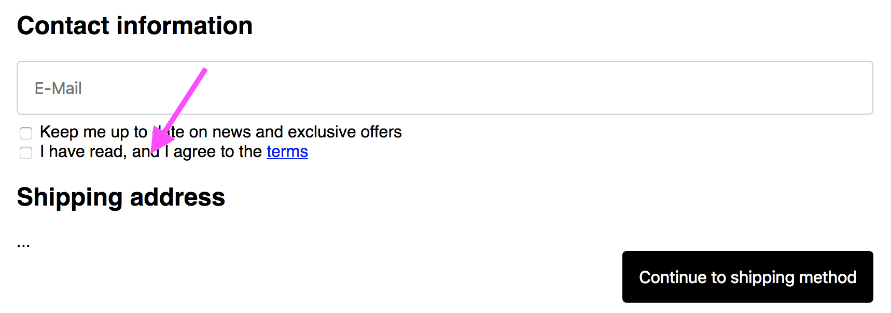
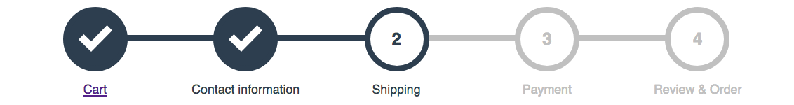

# Shopify Plugins

[](https://circleci.com/gh/nerdsofalltrades/shopify-plugins)
[](https://greenkeeper.io/)

Add features to your Shopify storefront and checkout with lightweight and easily integrateable plugins.

## Shop integration

Plugins are loaded dynamically and only in context. That means, that i.e. the _progress-bar_ plugin is only loaded in when visitor is in the checkout process.
The _accept-terms_ plugin is only loaded for the checkout contact information step.

To enable a plugin add this code to your _Google Analytics Additional Scripts_ section in Shopify's Admin / Online Store / Preferences.

```javascript
fetch('//cdn.jsdelivr.net/gh/nerdsofalltrades/shopify-plugins@0.1.6/dist/shopify-plugin-loader.min.js').then(function(
  result
) {
  result.text().then(function(script) {
    var plugin = document.createElement('script');
    plugin.innerHTML = script;
    document.body.appendChild(plugin);

    // Load plugins here
    var ctx = window.ShopifyPlugins;

    // Load the accept-terms plugin only in checkout
    // contact information step
    ctx.checkout.contactInformation.load('accept-terms');

    // Load the validate-contact-information plugin only in checkout
    // contact information step
    ctx.checkout.contactInformation.load('validate-contact-information');

    // Load the progress-bar plugin for all steps
    // in checkout
    ctx.checkout.all.load('progress-bar');

    // Load other plugins...
  });
});
```

## Plugins

### Accept terms plugin

This plugin adds a mandatory Accept Terms checkbox below the Accept Marketing
Checkbox in Shopify's contact information checkout step.



Add this code to enable it.

```javascript
ctx.checkout.contactInformation.load('accept-terms');
```

Without options standard english texts are displayed and the url of your terms
is expected to be found at `/pages/terms`. To change that just pass options
and set it up as you like.

```javascript
ctx.checkout.contactInformation.load('accept-terms', {
  // The checkbox label
  label: 'I have read and I agree to the',
  // The label of the terms link
  termsName: 'terms',
  // The url to your terms
  termsURL: '/pages/terms',
  // Message displayed when customer tries to go on without agreeing
  errorMessage: 'Please agree to our terms before your purchase'
});
```

### Validate contact information plugin

This plugin adds custom RegEx validators to Shopify's contact information checkout step.

Add this code to enable it.

```javascript
ctx.checkout.contactInformation.load('validate-contact-information', [
  {
    selector: '#checkout_shipping_address_address1',
    pattern: /.*[a-z]+.*[0-9]+.*/i,
    errorMessage: 'Please enter streetname AND number'
  }
]);
```

### Progress bar plugin

This plugin replaces the upper breadcrumb navigation of Shopify's checkout with
a bubble progress bar.
As the existing breadcrumb labels are used for displaying the single steps no additional
configuration is needed.



Add this code to enable it.

```javascript
ctx.checkout.all.load('progress-bar');
```

## Development

```shell
$ npm install
$ npm run dev
```

Open http://localhost:3000 to test the plugins.

## Note

This software is not correlated to Shopify.
